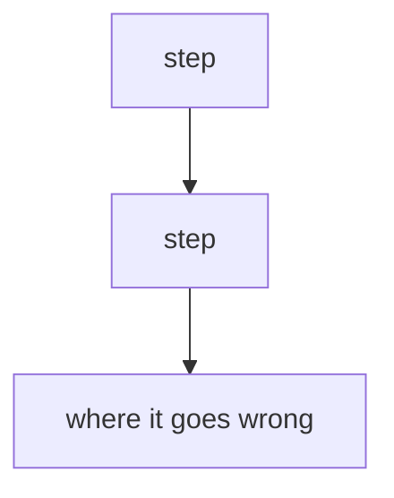
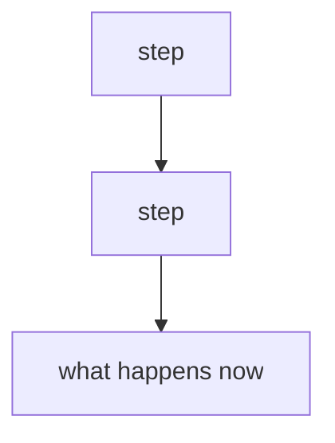

Issue:
<!-- 2-3 lines, plain language: what is wrong from the user's point of view. -->

Steps to Replicate:
<!-- How the issue happens, step by step. Numbered, so a reviewer can follow it on a site. -->
1.
2.
3.

Before Fix:
<!-- 2 lines: what was happening. -->

After Fix:
<!-- 2 lines: what happens now, and the outcome for the user. -->

Before - Flow Diagram:
<!-- The CURRENT flow, with the failure point marked. Keep it to 5-9 boxes and use business
     language, not function names. Quote every label: A["text"]. No brackets or colons inside a
     label, and use   for a line break. -->

After - Flow Diagram:
<!-- The SAME flow with your change. Keep the same shape as the Before diagram so the difference
     is obvious at a glance. -->

Before:
<!-- Screenshot or video of the problem. -->

After:
<!-- Screenshot or video of the fixed behaviour. -->

